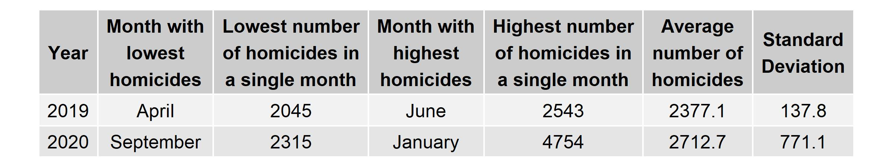
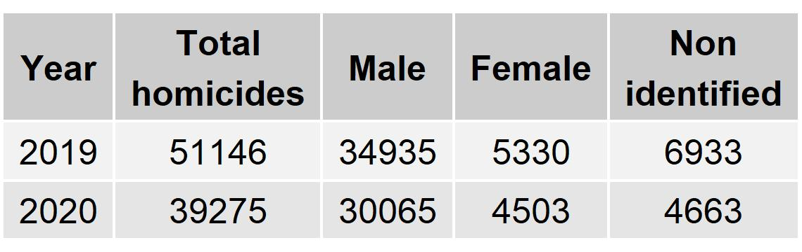
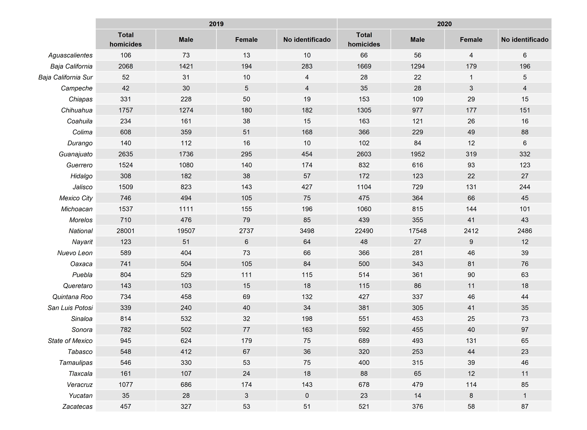
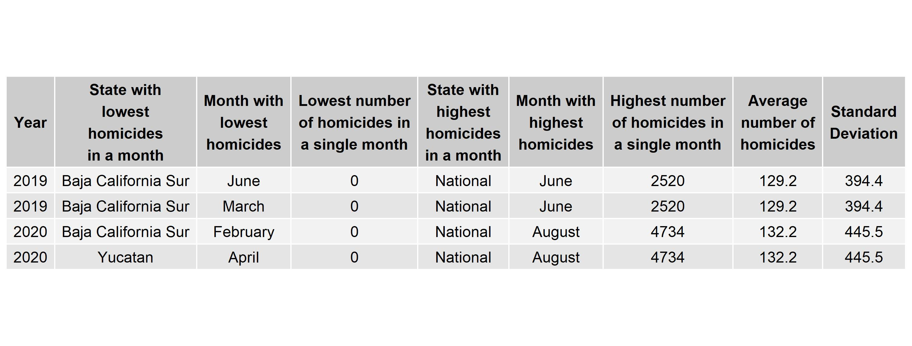

<!---  Initial set up for R programming --> 

```{r setup, include=FALSE}
# Knitr automatic options
knitr::opts_chunk$set(echo = TRUE)

# Load libraries
library(knitr)

# Create caption labels for tables 
cap_t1 <- "Number of cases and homicide rate per month at the national level"
cap_t2 <- "Descriptive statistics for the number of homicides at the national level"
cap_t3 <- "Descriptive statistics for the homicide rate at the national level"
cap_t4 <- "Total number of homicides and mortality rate by year and state"
cap_t5 <- "Descriptive statistics for the homicide rate at the state level"
cap_t6 <- "Number of homicides disaggregated by gender and year at the national level"
cap_t7 <- "Number of homicides disaggregated by gender and year at the state level"
cap_t8 <- "Descriptive statistics for the number of homicides at the national level"

# Create caption labels for graphics 
cap_g1 <- "Total homicides by month at the national level"
cap_g2 <- "Homicide rate by month at the national level"
cap_g3 <- "Total homicides by month in Mexico City"
cap_g4 <- "Homicide rate by month in Mexico City"
cap_g5 <- "Total homicides by month in Guanajuato"
cap_g6 <- "Homicide rate by month in Guanajuato"
cap_g7 <- "Homicide rate comparison by month at the national level"
cap_g8 <- "Homicide rate comparison by month in Mexico City"
cap_g9 <- "Homicide rate comparison by month in Guanajuato"
cap_g10 <- "Montly homicides by gender, 2019-2020"
cap_g11 <- "Homicide rate by month in Mexico City"
```

# The challenges of obtaining recent homicide data
Publishing official homicide data entails a rigurous and extense process. Before being accounted as a homicide by INEGI, every single case has to be confirmed by the local authorities as an actual crime. Due to this reason, official homicide data takes long to be open to the public. Normally, official data for a specific year is published one year after it ended. That is the reason why, so far, INEGI has only published homicide data for 1990 to 2018. 

What to do, then, if one wants to study the phenomenon of homice in Mexico in the recent 18 months? Luckyly, the Secretariat of Security and Citizen Protection (SSPC as its acronym in spanish) makes premiliminary homicide data available on its [website](http://www.informeseguridad.cns.gob.mx/). It uses two main sources of information: a daily report produced by an interdisciplinary team (constituted by the own SSCP, the military, the navy and the General Attoney's office); and open sources, constituted by homicide reports in local newspapers. The SSCP publishes daily reports for the numbers obtained from these two sources.

The problem with the reports that the SSCP uploads on its website is that they come in a pdf format, which means that a deep cleaning process is needed. In the first place, the documents have to be webscrapped from the web, then, they have to be transformed into an excel format and checked by a human. The cleaning process also requires ortographic correction and minor but numerous changes. After homicide data is cleaned, population data is added at both the state and municipal level for the estimation of the homicide rate. 

# Source 1: Interinstitutional group 
The daily reports produced by the interinstitutional group consist in a single table that shows the number of killings in each of the 32 Mexican states, as well as the national toll. This is the descriptive analysis produced after data cleaning. 

## National level homicides
Homicides in Mexico have increased significantly since 2008, when the militarization of the country took effect. In the following table, it can be appreciated that the homicide rate has been above 18.9 homicides per 100,000 inhabitants.

```{r t1, echo = FALSE, fig.cap = cap_t1, fig.align = 'center'}

```

Both the trends on the total number of homicides and the homicide rate show a stable number of homicides at the nation level. Besides a slight increase at the beggining of the time series, the levels are constant over time as shown in the next two figures.

```{r g1, echo = FALSE, fig.cap = cap_g1, fig.align = 'center'}
include_graphics("../figs/graphs/gpo_homicides_time_series/g_homicides_timeseries_National.pdf")
```

\newpage 

```{r g2, echo = FALSE, fig.cap = cap_g2, fig.align = 'center'}
include_graphics("../figs/graphs/gpo_mort_rate_time_series/g_mortrate_timeseries_National.pdf")
```

\newpage

We see that the descriptive statistics show an overall increase in the number of cases between 2019 and 2020. There is also less variance en 2020. But we need to take into account that there may be population changes between one year and another, as well as the fact that we don't have the same months for each year and we may be overlooking stationary effects. 

```{r t2, echo=FALSE, fig.cap = cap_t2, fig.align = 'center'}

```

When looking at the descriptive statistics for the mortality rate, we find, once more, that there was an increase in homicides from 2019 to 2020. But now there are not population effects. Still, there may be stationary effects that have not been accounted for.

```{r t3, echo=FALSE, fig.cap = cap_t3, fig.align = 'center'}

```


In the next section, we will see the information deagregated by state, in order to find more subtle differences in data. 

## State level homicides
In the next table, we show the total amount of homicides as well as the homicide rate for each state in 2019 and 2020. It is worth remembering that none of the years were complete in the original sources. For 2019, we only have information from April to December; while 2020 comprehends from January to July.

```{r t4, echo=FALSE, fig.cap = cap_t4, fig.align = 'center'}

```

\newpage 

A closer look to specific states' time series reveal that the stagnation seen at the national level is not the reality for all the regions. Instead, it seems to be the result of opposite trends: homicides went down in some states, while spiking at others. For instance, Mexico City is one of the states where homicides decreased after december of 2019. This trend is clear in the total number of cases, as in the homicide rate. 

```{r g3, echo = FALSE, fig.cap = cap_g3, fig.align = 'center'}
include_graphics("../figs/graphs/gpo_homicides_time_series/g_homicides_timeseries_Mexico City.pdf")
```

```{r g4, echo = FALSE, fig.cap = cap_g4, fig.align = 'center'}
include_graphics("../figs/graphs/gpo_mort_rate_time_series/g_mortrate_timeseries_Mexico City.pdf")
```

In constrast to the capital, Guanajuato is a prime example of states where homicide violence increased significantly in 2020, as it is shown in the following graphs that report the total number of cases in the state as well as it's homicide rate. 

```{r g5, echo = FALSE, fig.cap = cap_g5, fig.align = 'center'}
include_graphics("../figs/graphs/gpo_homicides_time_series/g_homicides_timeseries_Guanajuato.pdf")
```

```{r g6, echo = FALSE, fig.cap = cap_g6, fig.align = 'center'}
include_graphics("../figs/graphs/gpo_mort_rate_time_series/g_mortrate_timeseries_Guanajuato.pdf")
```

\newpage

The comparison between 2019 and 2020 becomes easier when comparing each month side by side. Unfurtunately, the SSPC data is not available for all of 2019's months. Nonetheless, we can see the patterns in the months that are present for both years for the three cases seen in this report: national level, Mexico City and Guanajuato. Since the homicide rate considers the effects of population, we display this measurement, the differences in the patterns are obvious. 


```{r g7, echo = FALSE, fig.cap = cap_g7, fig.align = 'center'}
include_graphics("../figs/graphs/gpo_mort_rate_5m_comparison/g_mortrate_timeseries_5m_National.pdf")
```


```{r g8, echo = FALSE, fig.cap = cap_g8, fig.align = 'center'}
include_graphics("../figs/graphs/gpo_mort_rate_5m_comparison/g_mortrate_timeseries_5m_Mexico City.pdf")
```


```{r g9, echo = FALSE, fig.cap = cap_g9, fig.align = 'center'}
include_graphics("../figs/graphs/gpo_mort_rate_5m_comparison/g_mortrate_timeseries_5m_Guanajuato.pdf")
```

\newpage

To appreciate more differences, we display descriptive statistic for each state in the following table. 

```{r t5, echo=FALSE, fig.cap = cap_t5, fig.align = 'center'}

```

\newpage

# Source 2: Open sources (newspapers)
Besides the interinstitutional group, the SSCP uses a second source for estimating the amount of homicides: local newspapers. On the website, there are daily reports with the amount of homicides registered at the county level. One of the main advantages of this source is that information is disaggregated by gender. Hence, we get more detailed information. Nonetheless, it can be flawed and that is why it is considerd, simply, as preliminary numbers.

## National level homicides 
As we just mentioned, the open source data from the SSCP offers the posibility of dissagregating information by gender. Please note that this feature was not implemented until February of 2019, for January data was only made available for the total number of homicides, this explains the inconsistency in the total number of homicides reported for 2019 and numbers broken down by gender. 

The fact that the amount of people killed for whom their gender could not be identified is greater than the number of women killed it is certainly worth of attention. One possible explanation is that the level of violence is so stagering that a considerable amount of people die in attrocious ways that leave their bodies unrecognisables. 

```{r t6, echo=FALSE, fig.cap = cap_t6, fig.align = 'center'}

```

\newpage

## State level homicides
The numbers of total homicides, homicides of men, women and people with their gender not identified are displayed in the next table. 

```{r t7, echo=FALSE, fig.cap = cap_t7, fig.align = 'center'}

```

\newpage
To gain further insight into the trends in the states, we present the time series for total homicides and homicide rate for Mexico City. 

```{r g10, echo = FALSE, fig.cap = cap_g10, fig.align = 'center'}
include_graphics("../figs/graphs/fa_homicides_time_series/g_homicies_time_series_all_genders_Mexico City.pdf")
```

```{r g11, echo = FALSE, fig.cap = cap_g11, fig.align = 'center'}
include_graphics("../figs/graphs/fa_mort_rate_time_series/g_mort_rate_time_series_total_Mexico City.pdf")
```

\newpage

Finally, we present a table with descriptive statistics for the sates data base. The table includes the states that had the lowest level of homicides in a single month, we can see that each year there are four cases where some state had just one homicide (Baja California, Campeche and Yucatan, twice, in 2019; and again Baja California and Yucatan, thrice, in 2020). In contrast, Guanajuato had the most violent month of each year. 

```{r t8, echo=FALSE, fig.cap = cap_t8, fig.align = 'center'}

```

